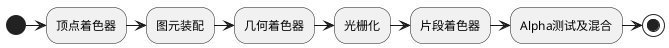
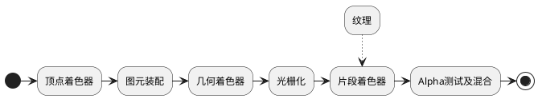

因为本文的意图，是把一系列的知识点串联起来，而不是逐个的深入分析，所以将会比较笼统。想要了解更多的细节，你可以参照文末的参考资料，或者自己搜索下各个知识点。当然，以后我也会不定期的针对某些点研究后再发文介绍。那么我们就开始吧。

先从第一步，也就是显示一张图片说起。对于我们开发人员来说，在iOS代码里面，想要显示一张图片，只需要新建一个`UIImage`，然后赋值到`UIImageView`里面就行。简而言之，我们直观所得的，就像是下面这张图里的样子：


但我们都知道，底层过程明显不是这么简单。所以继续深入挖掘，搜索一下相关的技术帖，我们发现新建`UIImage`对象时，仅仅是获取了图片的引用，并不是我们想象中的，直接就拿到了图片数据，然后把数据丢到屏幕上显示出来。

那是如何通过这个图片引用，把真正的图片内容显示出来的呢？研究下`SDWebImage`源码，我们发现其在子线程中，对下载完成后的图片，进行了一次decode操作。而这个decode操作，具体是做了什么。很多技术帖都解释过，是因为在iOS系统中，不会立即将`UIImage`所指向的图片数据进行解码，而是等到真正显示的时候，才会进行这个操作。但是真正显示的时候又是在主线程上的，所以为了减少对主线程的消耗，就在子线程上，提前对图片数据进行解码操作。

这一段话我们大多已经很熟悉了，但是图片的解码到底是解了什么。从矢量图、位图开始说起。

矢量图、位图我们都清楚，一个保存的是点、线等位置信息，一个保存的是像素集合。除了工程作图等比较少的场合，用的是矢量图以外，我们网页浏览、iOS工程中用的，大多数都是位图。因为位图保存的是像素集合，所以会记录下每个像素的颜色数据，常见的颜色数据格式有RGB、YUV、CMYK等。

那我们常见的`png`、`jpeg`格式又是什么。设想一下，如果不进行任何处理，直接保存下图片每个像素的颜色数据，形成一个二维数据矩阵，这样虽然可以对图片数据进行完整保存，但文件大小也必然是巨大的。所以为了减小图片文件的体积，我们需要用一些有损或者无损的压缩算法，对原始的数据进行压缩。因此，就出现了我们`png`、`jpeg`两种常见的图片文件格式。其中`png`用的是无损压缩算法，`jpeg`用的则是有损的压缩算法。

了解了图片的基本概念之后，再回到之前的图片数据解码操作，我们就明白了，这个操作的目的，就是把被压缩后的图片数据，恢复成可以用来显示的位图数据。同时，再扩展一点，`png`和`jpeg`两种格式的数据，哪一种解码更快呢？答案是`png`格式，因为大多数情况下，`jpeg`所使用的压缩算法要更复杂。

聊到这里，我们回过头再看一眼之前的图片显示流程，就变成了下面这个样子：


但是解码之后的数据，在代码上的表现是什么样的呢？我们来看`SDWebImage`中，用来进行解码的这行核心代码：

```
CGImageRef destImageRef = CGBitmapContextCreateImage(destContext);
```
可以看出是用到了`CoreGraphics`的API，然后我们再搜索一下最常见的`CGImageRef`数据类型，其本质是一个指向图片像素数据的，C语言结构体数据指针。同时我们也在其他技术帖中，知道了`CoreGraphics`库，就是系统绘制UI、文字、图片的基础库。所以我们再完善下图片显示流程：


到了这一步之后，我们还是想问。既然图片已经被解码成了点阵像素数据，那又是如何显示到屏幕上的呢？我们知道GPU在其中起到了很重要的作用，可以理解成我们的图像数据，先是磁盘中读取出来，交由CPU进行解码操作，然后再把解码后的数据，交给GPU进行变换、合成一系列的操作。紧接着，处理完成的数据被提交到帧缓冲区里，直到VSync信号抵达，帧缓冲区里的数据被最终绘制到屏幕上。大致的流程就像下面这样：


再继续追问，GPU又是怎样去做变换、合成这些操作的呢？CPU的数据又是怎样传递给GPU的呢？我们先聊第一个问题。

大家肯定都听过`OpenGL`，`OpenGL`是一个规范，或者说是一个API接口规范。其提供的那些API，就是用来控制GPU的变换、合成等操作的。而其规定的那些API接口的具体实现，则是显卡厂商、苹果公司去实现的。至于`OpenGL`的具体细节后面再聊，我们先继续解释第二个问题，即CPU的数据是怎样传递给GPU的。

首先GPU中包含着一部分显存空间(VRAM)，在设备启动的时候，作为PCI设备的GPU，其显存空间中的一部分地址，会被映射到PCI地址中，然后再把PCI总线上的地址映射到CPU地址中。这样，CPU就能通过对这段映射后的地址的访问，访问到GPU的存储空间。此外，还可以通过内存空间进行数据交互。首先系统为GPU动态分配一些不连续的内存空间(GTT)，用于映射到GPU的显存空间中。然后CPU通过对这段内存空间的访问，进行对GPU显存空间的访问。最后，除了以上两种方式以外，还可以通过DMA方式，进行数据交互。而对于GPU指令来说，则是直接由CPU通过PCI总线推送到GPU中，或者由GPU自己，从指令流中获取指令。更多具体的细节，可以参照介绍CPU、GPU协同的技术帖。

抛开底层的硬件实现细节，总的来说我们可以认为，在`CoreGraphics`库，和GPU之间，存在着`OpenGL`这一层。至于为什么把`OpenGL`单独看成一层，是因为`OpenGL`实际上并不是完全运行在GPU上，其一部分API的实现，还是运行在CPU中的。于是我们再次修改一下流程图：


至此，我们就把大致的图片显示过程弄清楚了。接下来，我们继续聊`OpenGL`。

### OpenGL
先解释几个名词：
- `OpenGL`：这个前面咱们聊过，可以理解成一个API接口规范，具体实现则交给硬件厂商来做
- `OpenGL ES`：`OpenGL`的子集，专门针对手机、平板等嵌入式设备
- `GLSL`：用于编写`OpenGL`着色器的专门语言
- `GLSL ES`：像`OpenGL ES`是`OpenGL`的子集一样，是`GLSL`的子集
- 固定渲染管线：在`OpenGL`的早期版本里，`OpenGL`提供了一套固定的着色器程序，我们只要调用API设置好参数就行了，这叫固定管线
- 可编程渲染管线：在新版本里，`OpenGL`不再提供默认着色器程序，需要我们手动实现，虽然学习、使用的时候比较麻烦，但是灵活性更高了，这就叫可编程管线

虽然有`OpenGL`、`OpenGL ES`的区别，但实际上其主要结构基本差不多，所以学习的时候任选一种都可以。而针对iOS开发，我们就选`OpenGL ES`和`GLSL ES`。

至于各个新老版本的区别、联系和对应关系，我们只关注iOS端的话大致像这样子：

| OpenGL ES | GLSL ES |
| --- | --- |
| 2.0 | 100 |
| 3.0 | 300 |

更多的版本对应关系，可以看参照[这个链接](https://github.com/mattdesl/lwjgl-basics/wiki/GLSL-Versions)。

然后，我们需要转变一个观念，我们日常的代码编写，对于函数、代码结构的设计，常见的方式是向函数传入数据、参数，然后函数返回新的数据，就像下面的伪代码：

```
- (object)function(object, param) {
}
```
但在`OpenGL`中，我们经常找不到这个传入、传出的数据。这是因为，大多数`OpenGL`的API，都是在对一个公用的存储空间进行操作，每个操作的指令，导致公用存储空间内数据进行相应的变化，所以经常有技术帖说`OpenGL`实质上是个大型状态机。

聊完了基本知识以后，就来看`OpenGL`的具体逻辑流程了。因为我们现在大多用的都是可编程渲染管线了，所以按照可编程管线的流程来说，大致分成这么几步：



我们用画个三角形的例子，挨个对每个阶段进行简单介绍：
- 顶点着色器：`vertex Shader`，是根据顶点数据，确定三角形的三个顶点的位置
- 图元装配：根据上一步的顶点位置，装配成基本的图元形状，比如三角形
- 几何着色器：对上一步的图元进行变换，形成新的图元，具体细节还没研究
- 光栅化：把图元映射为最终显示在屏幕上的像素，同时也会裁掉屏幕显示范围之外的内容
- 片段着色器：`Fragment Shader`，计算每个像素的颜色，计算规则受了很多因素的影响，例如光照之类的3D场景数据
- Alpha测试及混合：因为每个屏幕像素点上，可能堆叠了多个颜色数据，所以就要根据深度、alpha值进行计算

而反映到具体的iOS代码上，还要多出新建图层等等一系列操作，总的来说分成下面这几步：
- 设置layer的类型为`CAEAGLLayer`
- 新建`EAGLContext`类型的上下文，并且设置为当前context
- 清除掉之前旧的`renderBuffer`和`frameBuffer`
- 创建`renderBuffer`、`frameBuffer`并绑定
- 分配`renderBuffer`的内存空间，并绑定到layer上
- 构造顶点着色器并编译
- 构造片段着色器并编译
- 构造着色器程序，并关联顶点、片段着色器
- 创建顶点对象，链接顶点属性
- 设置背景色
- 清空颜色缓冲数据
- 设置渲染窗口
- 激活着色器程序
- 关联数据
- 最终绘制

步骤很多很复杂，不过按照场景不同，部分步骤是可以省略的，比如设置背景色。同时有部分步骤的顺序也是可以调整的，比如设置渲染窗口可以放在更前面执行。具体的样例代码，可以参照本文最后的github链接。

这么一大串下来，我们就能搞定一个三角形的显示了。至于四边形、圆形的显示，可以参照各类`OpenGL`教程，通过图元组合的方式搞定。但是回到图片显示上来看，图片数据却是以纹理的形式，进入`OpenGL`渲染流程的，就像下面的流程图一样：



既然图片纹理数据，是在片段着色器阶段进入渲染管线的，那我们就明白了，纹理数据包含的，是存储各像素点颜色的位图数据。也就是说，我们可以在片段着色器里面，对图片每个像素点的颜色进行操作。于是，滤镜效果就有了实现的机会。

### GPUImage滤镜
`GPUImage`大家都知道，算是最出名的滤镜库了。我们先不管它的滤镜链、数据采集、存储、转化等等功能，只看单一滤镜的效果是如何实现的，用`GPUImageColorInvertFilter`这个滤镜举例。

这个滤镜的作用是实现图片的反色，也就是下面这样的效果：


我们直接看这个滤镜的源代码，主要起作用的部分，在于其自定义的片段着色器中：

```
varying highp vec2 textureCoordinate;
uniform sampler2D inputImageTexture;
void main() {
    lowp vec4 textureColor = texture2D(inputImageTexture, textureCoordinate);
    gl_FragColor = vec4((1.0 - textureColor.rgb), textureColor.w);
}
```

一句一句分析，第一句：
```
varying highp vec2 textureCoordinate;
```
这句的作用，是接收从顶点着色器中传入的纹理坐标，至于纹理坐标的作用，具体可以参考各种`OpenGL`教程

然后第二句：
```
uniform sampler2D inputImageTexture;
```
这句的作用，是接收我们从代码中传入的纹理数据，具体的传入方式，可以参照文章最后的github工程

再下一句：
```
lowp vec4 textureColor = texture2D(inputImageTexture, textureCoordinate);
```
这句的作用，是通过使用`GLSL`内建的`texture2D`函数获取纹素。听起来有点难懂，简单理解的话，可以认为是根据纹理数据，和坐标数据，得到屏幕上每个位置对应要显示的RGBA颜色。而得出的RGBA颜色，就被存在了`lowp`精度，`vec4`类型的变量`textureColor`中。

最后一句：
```
gl_FragColor = vec4((1.0 - textureColor.rgb), textureColor.w);
```
这句我们分开看，首先第一部分`(1.0 - textureColor.rgb)`的意思，是把刚才得到的RGBA颜色数据中，单独取出RGB颜色值，每一位都和1.0相减，这样就能得到反色了的RGB值。然后再把反色后的RGB值，和原始的alpha值，也就是`textureColor.w`进行混合，得到新的`vec4`类型的，完整的反色了的，但alpha透明度没有变化的RGBA值。最后，把新的RGBA颜色值，赋值给`GLSL`内建颜色变量`gl_FragColor`，用来进行下一步的操作。

至此，我们就弄明白了这个简单的反色滤镜，其实现原理是什么样的了。当然其他的高级滤镜，比如高斯模糊、贴图、人脸识别等等，也都大同小异，感兴趣的话可以挨个去分析源码。

### 离屏渲染
我们都听过离屏渲染这个概念，也大都知道为了提升性能降低掉帧率，就得避免离屏渲染的出现。可是离屏渲染到底是什么？既然要避免，为什么还会存在呢？

回到`OpenGL`这一段的内容，我们发现在显示一个三角形的代码中，包含了`renderBuffer`和`frameBuffer`两个东西。先聊聊这两个词的意思：

- renderBuffer：渲染缓冲，包含了一系列的几何、像素数据
- frameBuffer：帧缓冲，管理着渲染缓冲、纹理等一系列数据

那为什么要存在离屏渲染呢？我们用不太准确但比较容易理解的说法来聊这事。假设想要把渲染管线的最终结果，显示到屏幕上，那就得有个缓冲用来存储每一帧需要渲染的数据，我们把这个缓冲称为默认帧缓冲。

但是经过后面的发展，`OpenGL`需要支持不直接渲染到屏幕上的能力，也就是在默认帧缓冲之外，创建一个离屏渲染用的帧缓冲，用来存储纹理、几何、像素之类的数据，这样就方便我们对其中的数据，在离屏状态下进行操作、变换和部分复用来减少开支。举个例子，对于一个动画来说。如果直接生成输出每步的渲染数据，需要我们一遍遍完整的走过渲染管线。但是如果采用离屏渲染的方式，我们就可以直接复用离屏的`frameBuffer`里面的数据，然后根据每一步的变化进行微调得出最终显示效果，这样子的做法肯定是更高效的。

只不过对于我们常见的列表滑动来说，我们事实上是不需要这样的一个操作，直接直出结果就好，省掉离屏`frameBuffer`数据切换过程这一步，反而更能节省时间。

不过有些技术帖中，把离屏渲染分成了CPU、GPU两种情况。还有的技术帖中，说离屏上下文的切换其实很快没什么影响，真正有影响的是有没有使用硬件加速，或者是多余的`glFlush`操作。但无论如何，减少GPU操作这个想法是没错的。

### 其他性能优化方案
除了避免离屏渲染以外，我们常见的性能优化方法，还有减少透明图层的数量、降低图片质量、对齐像素位等等方法。那这些方法的底层原理，我们可以挨个对齐`OpenGL`渲染管线中的步骤。

比如减少透明图层的数量，就是降低了Alpha测试阶段的计算量。降低图片质量，就是降低了纹理数据的生成、映射工作的计算量。对齐像素位，就对应着减少光栅化阶段，边缘模糊带来的计算量。当然这么简单对应不是十分的准确，但大致是这么个思路。

### OpenGL学习样例工程
`OpenGL`学习过程中的简单样例源码实现，可以点进这个github工程参考一下。

[https://github.com/BenArvin/BAOpenGLLearning](https://github.com/BenArvin/BAOpenGLLearning)

目前工程中包含了三角形、四边形、圆形、纹理渲染、简单滤镜之类的代码，3D效果之类的，后面不定期更新上去。

### 部分参考资料
[LearnOpenGL CN](https://learnopengl-cn.github.io)
[Getting Pixels onto the Screen](https://www.objc.io/issues/3-views/moving-pixels-onto-the-screen/#asynchronous-drawing)
[OpenGL Wiki](https://www.khronos.org/opengl/wiki/Main_Page)
[PNG,JPEG,BMP,JIF图片格式详解及其对比](https://blog.csdn.net/u012611878/article/details/52215985)
[CPU与GPU协同工作](https://blog.csdn.net/xiaowei7hao/article/details/78194937)
[iOS 保持界面流畅的技巧](https://blog.ibireme.com/2015/11/12/smooth_user_interfaces_for_ios/#more-41893)