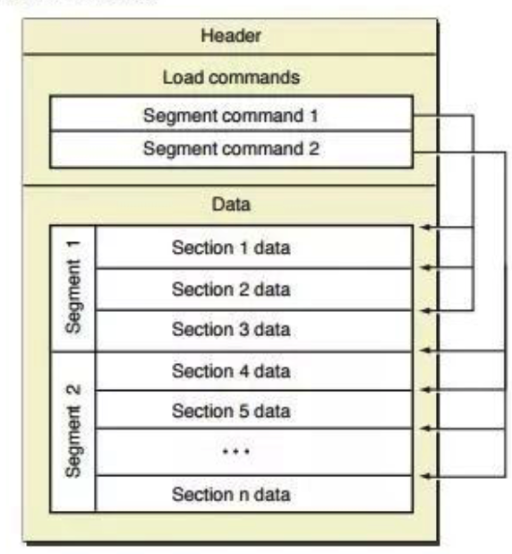
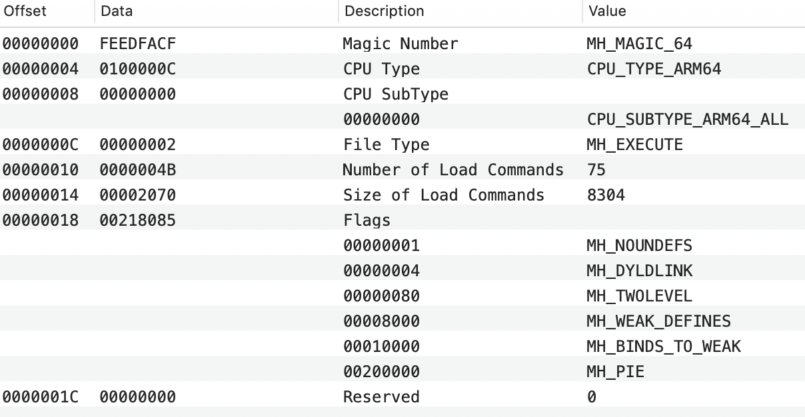

## 1、Header

- Magic Number：标识这个Mach-O文件对应的是32位还是64位，例如`MH_MAGIC_64`表示64位
- CPU Type：标志这个Mach-O文件对应的CPU信息
- CPU SubType：同CPU Type
- File Type：标志这个Mach-O文件的具体文件类型。有`MH_OBJECT`、`MH_EXECUTE`、`MH_BUNDLE`各种类型
- Number of Load Commands
- Size of Load Commands
- Flags：集合，标志用于Mach-O的可选功能
- Reserved：暂空，留作未来使用

## 2、Load Commands

## 3、Segments
双下划线+全大写：__TEXT

### 3.1、__PAGEZERO
可执行文件的第一个segment，位于虚拟内存中的location 0。其大小为一个完整虚拟内存页的大小，但实际上因为并不存储任何数据在其中，所以在文件中的大小为0
> The static linker creates a \_\_PAGEZERO segment as the first segment of an executable file. This segment is located at virtual memory location 0 and has no protection rights assigned, the combination of which causes accesses to NULL, a common C programming error, to immediately crash. The \_\_PAGEZERO segment is the size of one full VM page for the current architecture (for Intel-based and PowerPC-based Macintosh computers, this is 4096 bytes or 0x1000 in hexadecimal). Because there is no data in the \_\_PAGEZERO segment, it occupies no space in the file (the file size in the segment command is 0).

### 3.2、__TEXT
包含了可执行代码，及其他的只读数据。用于内核将其直接映射至共享内存中，并设置为不可写状态。一旦映射结束，其内容可被其他进程使用，所以常用于frameworks、bundles及共享libraries。此外因为只读属性，所以可以直接释放其内存块，而不用回写到硬盘中
> The \_\_TEXT segment contains executable code and other read-only data. To allow the kernel to map it directly from the executable into sharable memory, the static linker sets this segment’s virtual memory permissions to disallow writing. When the segment is mapped into memory, it can be shared among all processes interested in its contents. (This is primarily used with frameworks, bundles, and shared libraries, but it is possible to run multiple copies of the same executable in Mac OS X, and this applies in that case as well.) The read-only attribute also means that the pages that make up the \_\_TEXT segment never need to be written back to disk. When the kernel needs to free up physical memory, it can simply discard one or more \_\_TEXT pages and re-read them from disk when they are next needed.

### 3.3、__DATA
用于存储可写数据。当映射至内存中时，因为其可写属性，会为每个进程拷贝一份(logically)，以避免各自互相影响。
> The \_\_DATA segment contains writable data. The static linker sets the virtual memory permissions of this segment to allow both reading and writing. Because it is writable, the \_\_DATA segment of a framework or other shared library is logically copied for each process linking with the library. When memory pages such as those making up the \_\_DATA segment are readable and writable, the kernel marks them copy-on-write; therefore when a process writes to one of these pages, that process receives its own private copy of the page.

### 3.4、__OBJC
包含用于runtime特性支撑的library数据
> The \_\_OBJC segment contains data used by the Objective-C language runtime support library.

### 3.5、__IMPORT
保存可执行文件中未定义的symbol残余，仅用于IA-32架构
> The \_\_IMPORT segment contains symbol stubs and non-lazy pointers to symbols not defined in the executable. This segment is generated only for executables targeted for the IA-32 architecture.

### 3.6、__LINKEDIT
存储用于动态链接时的原始数据，如symbol、string、relocation table entries
> The \_\_LINKEDIT segment contains raw data used by the dynamic linker, such as symbol, string, and relocation table entries.

## 4、Sections
双下划线+全小写：__text，存储于segments中。\_\_TEXT、\_\_DATA中存储标准类型section，\_\_OBJC中存储仅对OC编译器开放的section

\_\_TEXT

- \_\_text：可执行的机器码
- \_\_cstring
- \_\_picsymbol\_stub
- \_\_symbol\_stub
- \_\_const

\_\_DATA

- \_\_data
- \_\_la\_symbol\_ptr：lazy symbol pointers
- \_\_nl\_symbol\_ptr：non-lazy symbol pointers
- \_\_dyld

\_\_IMPORAT

- \_\_jump\_table：Stubs for calls to functions in a dynamic library，用于函数调用
- \_\_pointers：用于文件引用

[https://web.archive.org/web/20090901205800/http://developer.apple.com/mac/library/documentation/DeveloperTools/Conceptual/MachORuntime/Reference/reference.html#//apple_ref/doc/uid/TP40000895-CH248-95908](https://web.archive.org/web/20090901205800/http://developer.apple.com/mac/library/documentation/DeveloperTools/Conceptual/MachORuntime/Reference/reference.html#//apple_ref/doc/uid/TP40000895-CH248-95908)